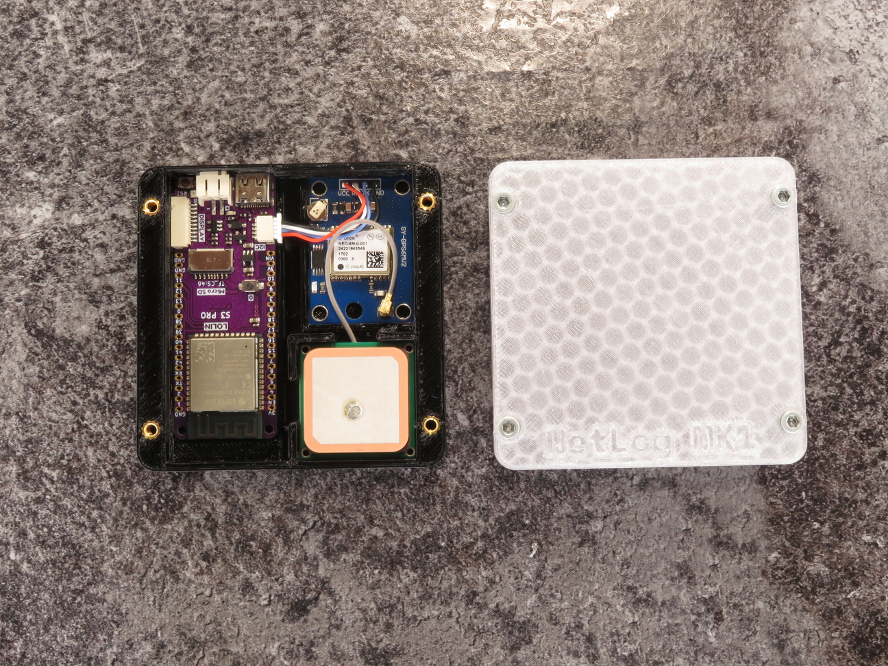

# NetLog MK1

The NetLog MK1 is a WiFi network scanning (wardriving) device based on
the ESP32-S3 and an inexpensive GPS module.

The NetLog MK1 is designed to be operated from a power bank or car USB charger.
The networks are stored in a CSV file on a FAT12 or FAT16 filesystem.

The NetLog MK1 will appear as a USB disk once connected to a computer.
From there, you can open the CSV file with any spreadsheet software (like LibreOffice, Google Sheets, etc).

- [Build your own](docs/build_tutorial.md)
- [Flashing the firmware](docs/flashing_tutorial.md)

## RGB LED light codes
| Light code     | Meaning                               |
|----------------|---------------------------------------|
| Static yellow  | Device starting                       |
| Static red     | FS error. Format with FAT12 or FAT16  |
| Blinking green | Establishing GPS fix                  |
| Blinking red   | Could not communicate with GPS module |
| White blink    | Network found                         |
