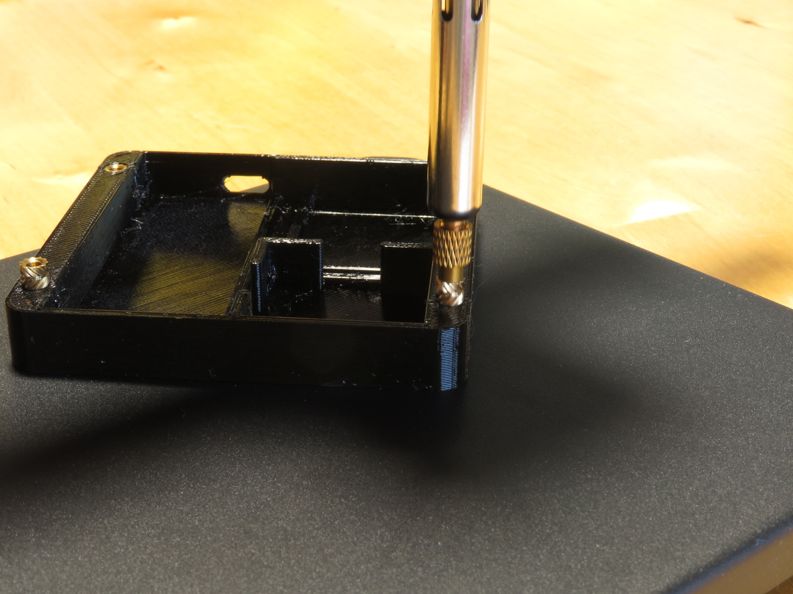
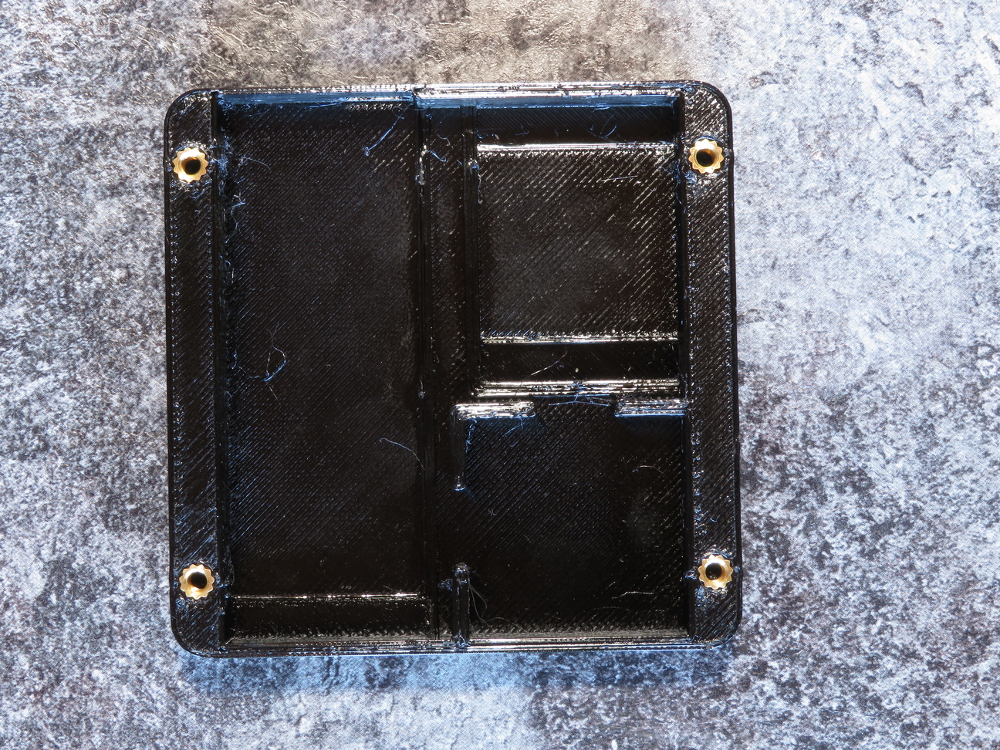
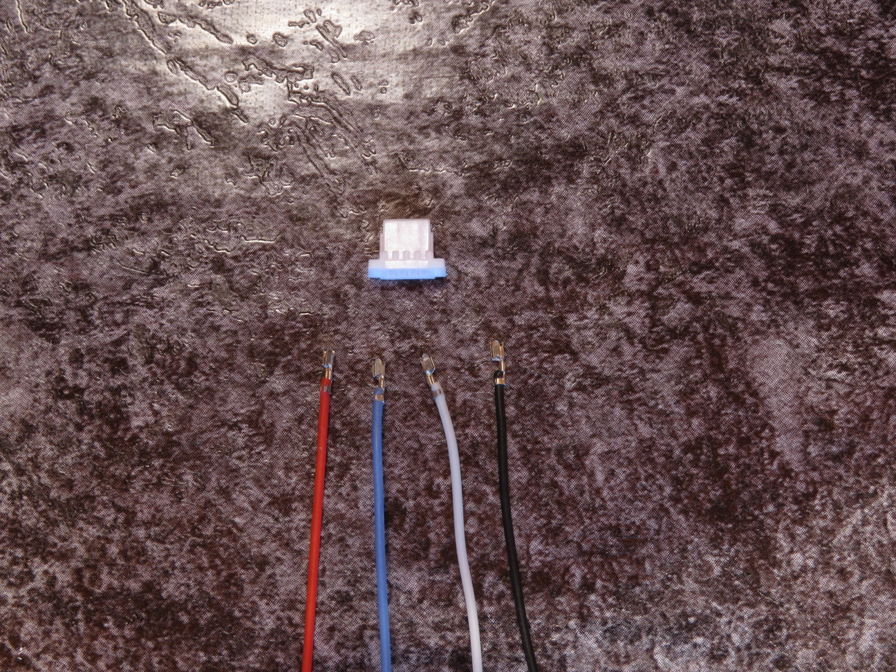
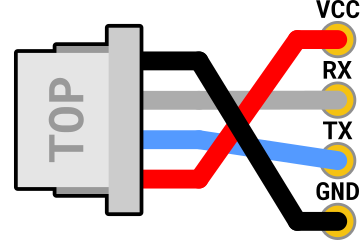
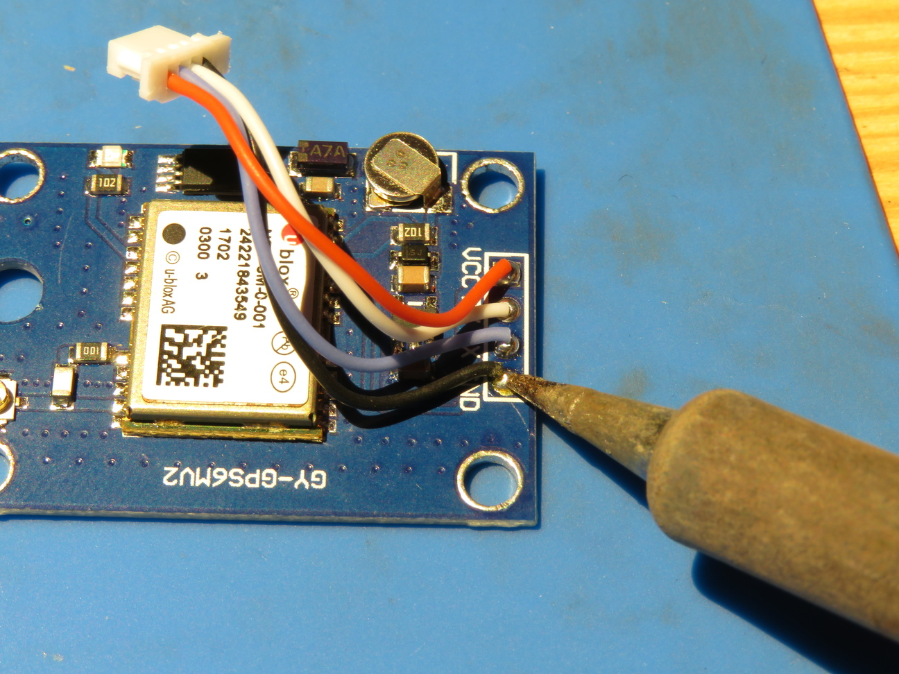
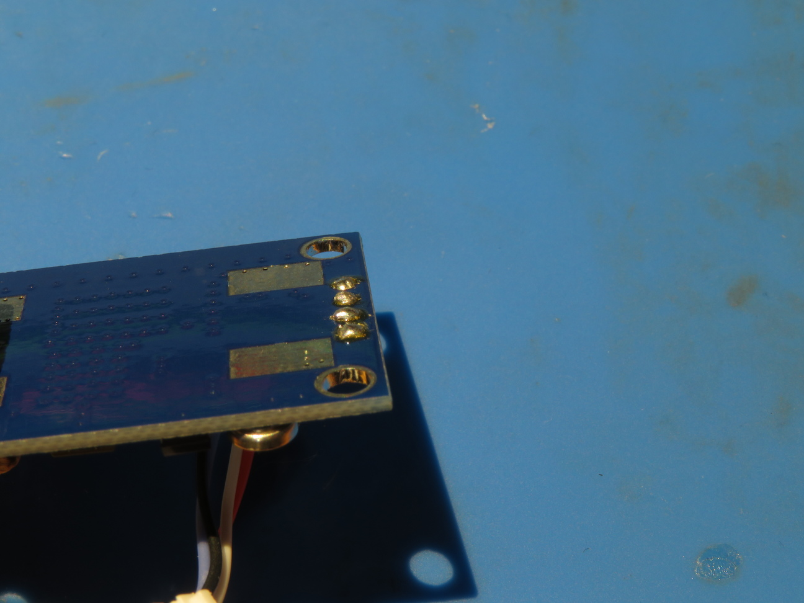
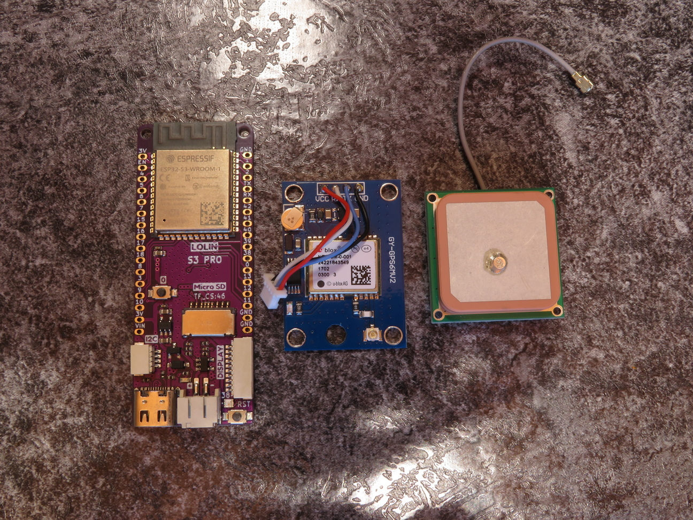
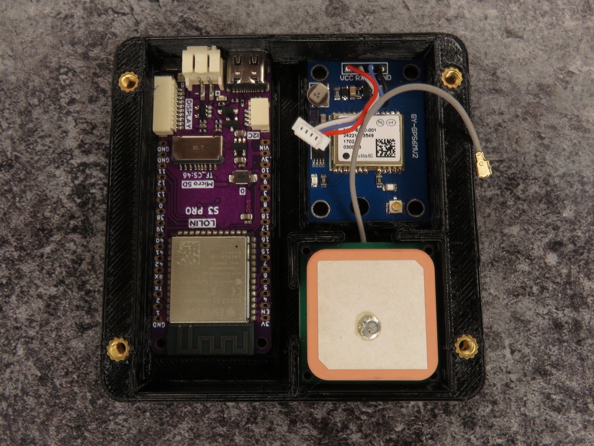
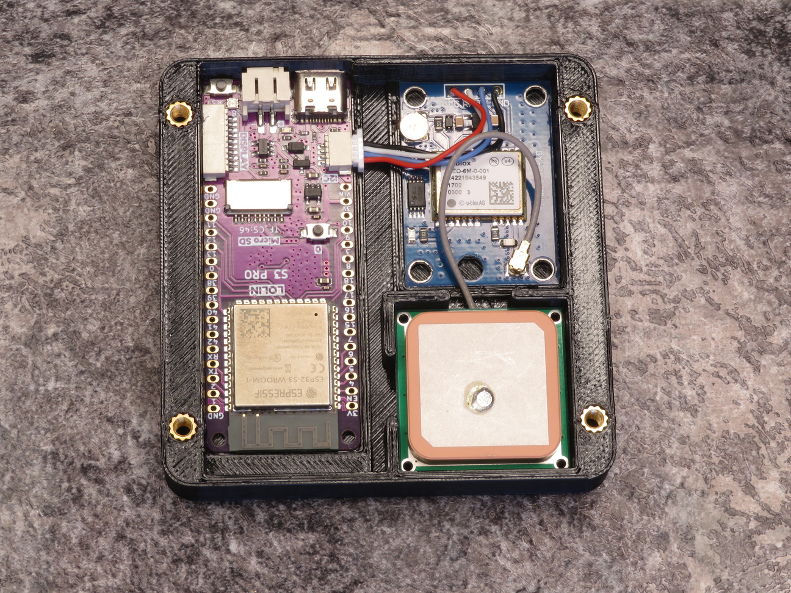
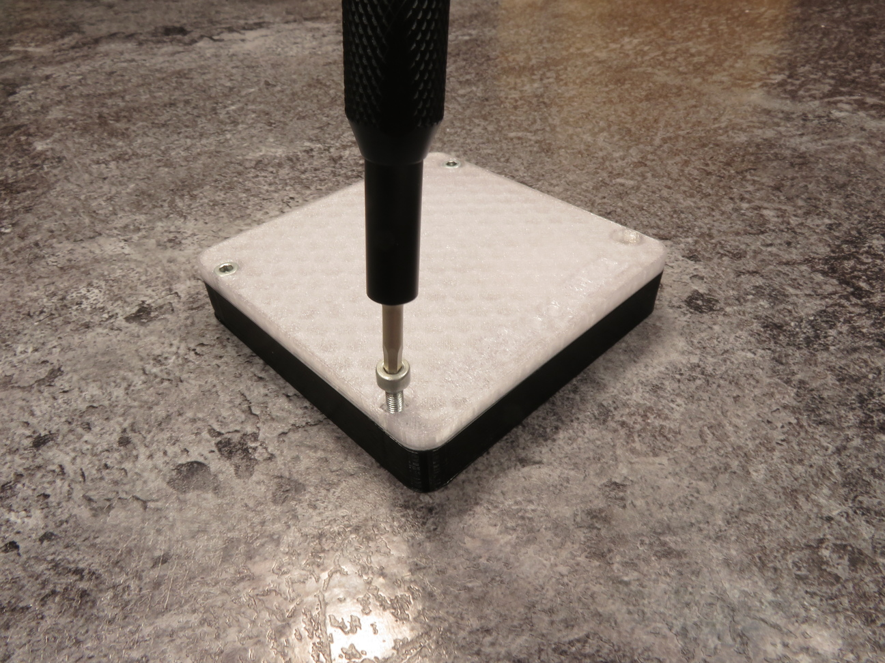

# Building a NetLog MK1
To build a NetLog MK1, you need the following tools and parts:

| Tools                 |
|-----------------------|
| Soldering iron        |
| Flushcutters          |
| 3D printer            |
| Wire strippers        |
| 2.5mm hex screwdriver |

| Parts                         |
|-------------------------------|
| LOLIN S3 Pro dev board        |
| 4x M3 threaded inserts        |
| 4x M3 hex socket cap screws   |
| GY-NEO6MV2 GPS module         |
| 28 x 28 x ~9mm uFL GPS antenna |
| JST SH 4-pin connector        |
| 4x JST SH cables              |

## Step 1: Building the case
Print `case.stl` with PLA or PET(G). Next, insert four M3 threaded inserts into the screw holes.

When you're done, the case should look something like this:

## Step 2: Preparing the GPS module
Next, we'll connect a JST SH (1.0mm) 4-pin cable to the GPS module.

I recommend getting a set that has pre-crimped cables, as manually crimping these connectors can be difficult.

Insert the cables into the connector, and cut the ends so they are about
5cm long, and strip the ends of the cables. Then, solder them to the GPS module with the pinout shown in the image below:

This is what the result should look like:

For the GPS module to fit in the case, you will need to cut the solder blobs on the bottom of the GPS module:

## Step 3: Printing the cover
Print `lid.stl` with **clear** PLA or PET(G). This is so that the LEDs can shine through the cover.

Those weird towers on the cover hold the components in place.

## Step 4: Assembling the device
Now we have the case, cover, and components ready for assembly.

Put the components in the case like this:

> Note: Due to tight tolerances, getting the components in their slots may take some force.

Next, connect the JST cable of the GPS module into the S3 Pro's I2C port, and the GPS antenna's uFL connector to the GPS module.

> While the 4-pin JST connector on the S3 Pro is intended for I2C,
    the versatility of the ESP32's GPIO pins allows us to use it for
    UART as well.

> Before attaching the cover, it may be a good idea to [flash the firmware.](flashing_tutorial.md)

Now, we can screw the cover on to the case:

With this, your NetLog MK1 is finished!
In case you haven't already, you now just have to [flash the firmware.](flashing_tutorial.md)
