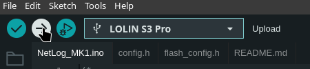

# Flashing the Firmware

Open `NetLog_MK1.ino` in Arduino IDE and install the following boards and libraries:

1. [Install the ESP32 boards](https://docs.espressif.com/projects/arduino-esp32/en/latest/installing.html)

2. Install the following libraries:
    - TinyGPSPlus
    - Adafruit NeoPixel
    - SdFat - Adafruit Fork
    - Adafruit SPIFlash
    - Adafruit TinyUSB Library

If you want, you can configure some parameters in `config.h`. Next,
select `LOLIN S3 Pro` and the connected serial port in the board selector.

Then, under the _Tools_ menu:

- enable _USB CDC On Boot_
- set _USB Mode_ to _USB-OTG (TinyUSB)_
- set _Partition Scheme_ to _16M Flash (2MB APP/12.5MB FATFS)_

Once you've done that, upload the sketch by clicking on the upload button.

> Flashing the firmware through hardware CDC is not possible
    once the device is mounted as a USB flash drive.
    Instead of booting into DFU mode, you can set _Upload Mode_ to
    _USB-OTG CDC (TinyUSB)_.

Once you've flashed the firmware and restarted the device, the LED will glow yellow and then turn solid red.
This indicates a filesystem error, as we first have to format the FATFS partition with FAT12 or FAT16.

On Linux, you can format the device by running `sudo mkfs.vfat /dev/sdX`,
with `sdX` being the block device, which you can find by running `lsblk`.

Now the device should be ready for use.

> The BSSIDs text file the device creates contains the BSSID
    of every network it has already found (which networks it should ignore).
